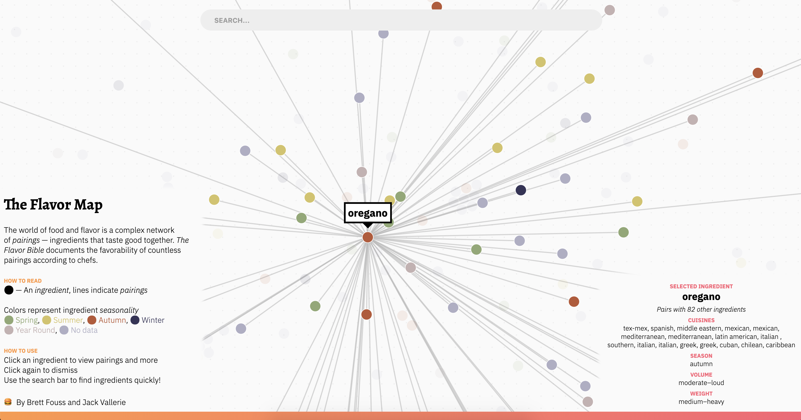

# flavor-map

Visualizing ingredient pairings and properties from [*The Flavor Bible*](https://www.amazon.com/Flavor-Bible-Essential-Creativity-Imaginative/dp/0316118400) using force layouts. Created with React, Redux and D3 by [Brett Fouss](https://github.com/brettfouss) and [Jack Vallerie](https://github.com/jackvallerie).

Visit the app at [food.tools](https://food.tools).

## A bit on the drawing algorithm

We use a d3 force simulation along with a combination of built-in and custom forces to arrange the ingredient nodes on the screen. Though the position of each node has no exact or precise semantic meaning, the algorithm aims to generally group nodes by cuisine. We compute a force-link simulation for each cuisine to attain centers of gravity for each cuisine, where more related cuisines are closer together. We then run and draw a simulation on the ingredient nodes and coerce them towards each cuisine they belong to, as well as towards other ingredients with their unique cuisine set. Therefore, ingredients that are part of many cuisines will be towards the center of the graph, while ingredients that are part of only one cuisine with be clustered together with other cuisine ingredients.

## Other

Hosting by ZEIT Now.
Find a bug or have a suggestion? Please let us know on our [issue tracker](https://github.com/food-tools/flavor-map/issues)!
